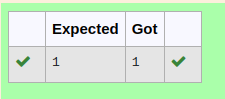

# RANK-OF-A-MATRIX
## Aim:
To write a python program to find the rank of a matrix
## Equipment’s required:
1. 	Hardware – PCs
2. 	Anaconda – Python 3.7 Installation / Moodle-Code Runner
## Program:
```
import numpy as np
a = np.array([[1,2,3],[3,6,9]])
rank = np.linalg.matrix_rank(a)
print(rank)
```

## Output:

## Result:
Thus the rank for the given matrix is successfully solved by  using a python program.

